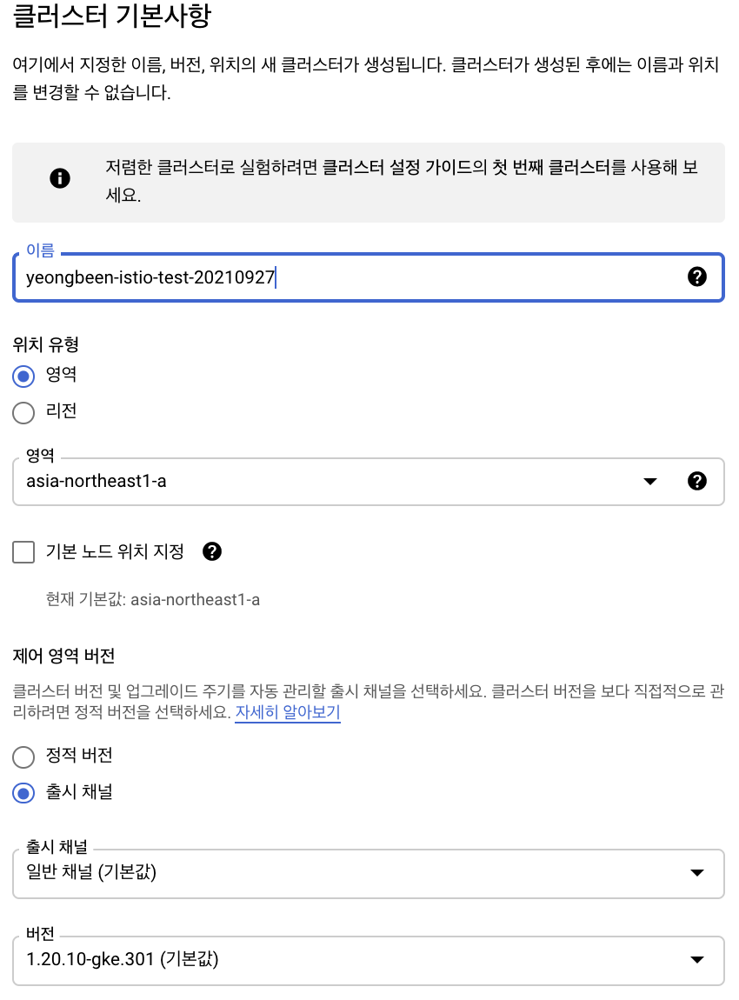
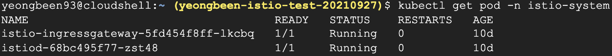
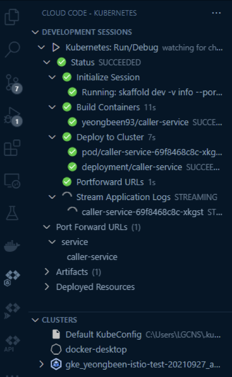
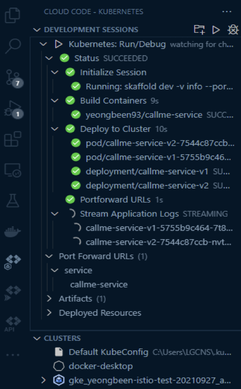

## 서문
이제 실제 코드와 함께 istio 예제를 실습해보자.   
해당 글은 다음 블로그의 포스팅을 실습하며 작성한 글이다. [piotrminkowski.com](https://piotrminkowski.com/2020/06/01/service-mesh-on-kubernetes-with-istio-and-spring-boot/)   
해당 글과의 차이점은 minikube를 이용하지 않고 GCP환경의 GKE로 쿠버네티스 환경을 구축하였고, VSCode의 CloudCode를 사용해서 서비스 배포를 진행했다.   
예제 내에서 사용하는 명령어는 구글 클라우드 콘솔에서 Cloud Shell내에서 진행한다.


# GKE 구축 및 istio 설치
1. GKE 클러스터 생성   
    
2. istio 설치
   - 명령어를 통해 최신 istio를 설치한다.
   ```
   curl -L https://git.io/getLatestIstio | sh -
   ```
   - PATH를 설정한다.
   ```
   cd istio-1.11.3

   export PATH=$PWD/bin:$PATH
   ```
   - 다음 명령어를 통해 쿠버네티스에 실제로 istio를 설치한다.
   ```
   istioctl install --set profile=demo -y
   ```
   - 실제로 설치가 정상적으로 진행되었는지 kubectl 명령어를 통해 확인한다.
   ```
   kubectl get pod -n istio-system
   ```
   
3. sidecar injection 기능 활성화를 위한 라벨 추가
   - 라벨 추가 명령어
   ```
   kubectl label namespace default istio-injection=enabled
   ```
   - 라벨 확인 명령어
   ```
   kubectl get ns --show-labels
   ```


## 예제 코드 설치 및 Cloud Code설치
1. git clone을 이용한 예제 어플리케이션 설치 (로컬환경의 위치에서 설치)
   ```
   git clone https://github.com/JoYeongbeen/istio.git
   ```
2. VSCode 설치
3. 확장프로그램 CloudCode 설치
   


## Cloud Code 클러스터 연결 및 어플리케이션 실행
1. `Cloud Code-Kubernetes`의  `Clusters`창의 헤더에서 + 버튼(Add a Cluster to the KubeConfig)을 누른다.
2. Google Kubernetes Engine을 선택하여 클러스터를 선택한후 GCP 계정에 로그인하여 클러스터를 선택한다.
    
3. Cloud Code의 메뉴에서 Run on Kubernetes를 선택해 caller-service, callme-service의 scaffold.yaml파일을 각각 실행시킨다. 
4. 아래는 정상 실행된 어플리케이션 모습이다. (각각 caller-service, callme-service)
    |caller-service|calleme-service|
    |---|-----|
    | | |


    
    